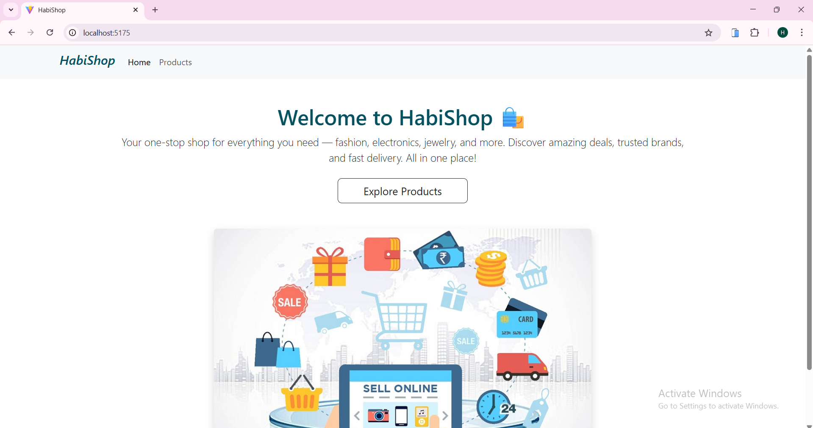
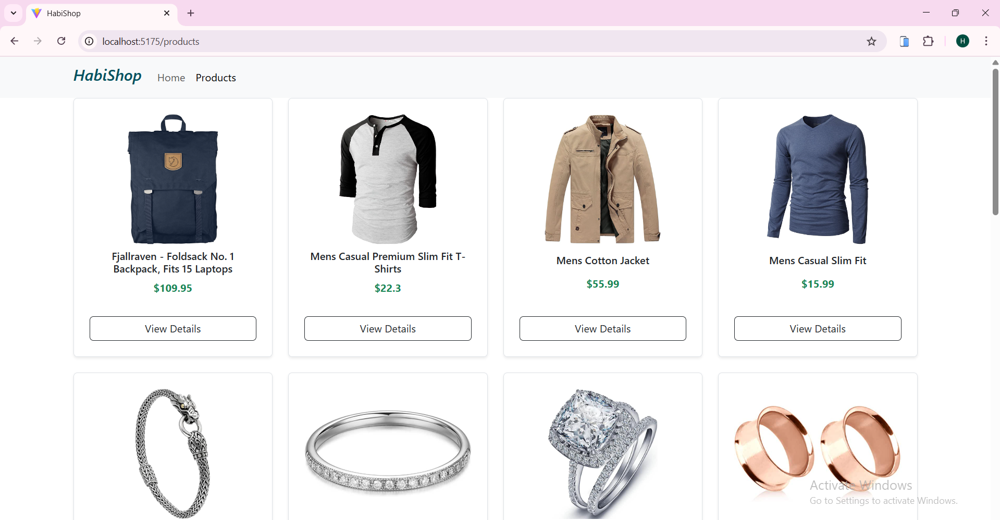
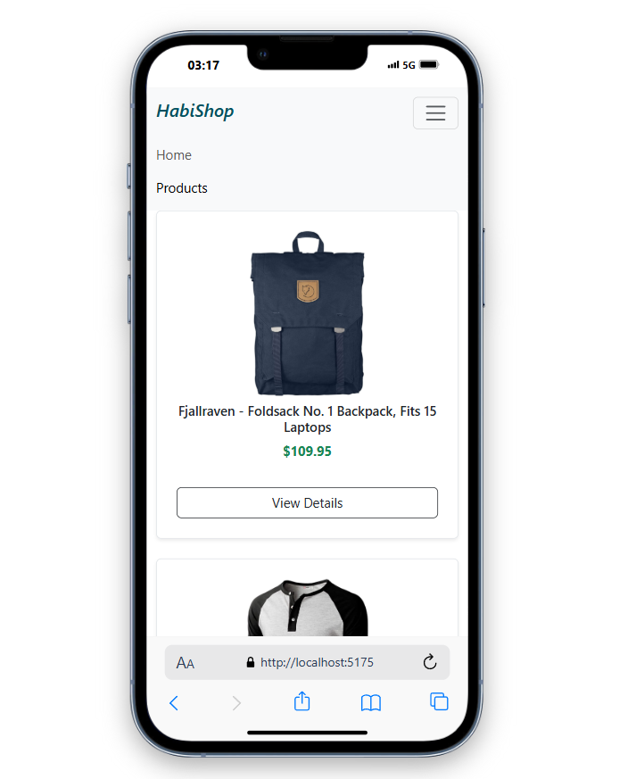
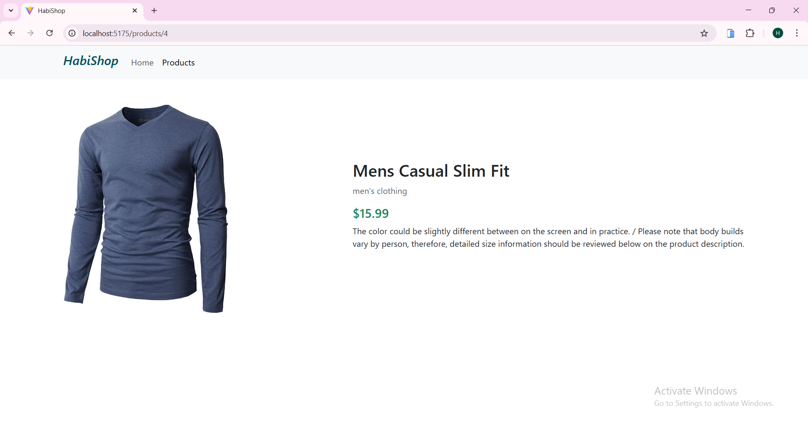
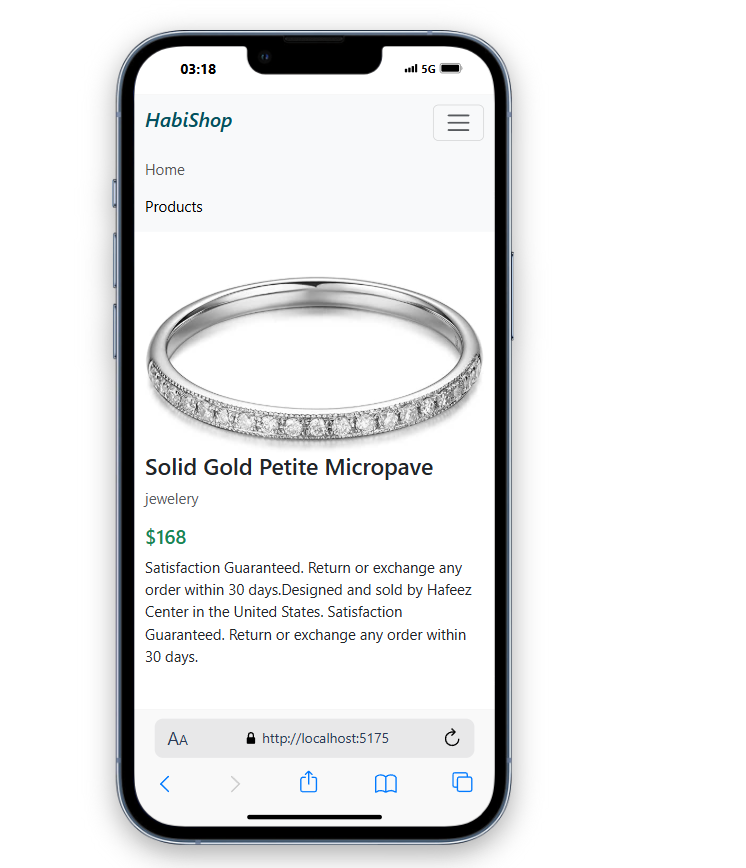

# 🛍️ HabiShop

## Overview
Welcome to **HabiShop**, a modern React-based e-commerce web application.

## Screenshots
**Home Page**


**Products Page**


**ProductsDetails Page**


## Features

-  ***Home Page with welcome banner***
- *** Products Page***:(fetching products from [FakeStoreAPI](https://fakestoreapi.com/))
-  ***Product Details Page***: Browse through a collection of products with image previews
-  ***Responsive Design with Bootstrap***:Fully responsive layout that works on mobile, tablet, and desktop devices
 ***Modern UI***: Clean and intuitive user interface built with Bootstrap
-  ***Asset images from local `/assets` folder***
-  Navigation using React Router
-*** Loader component for API calls***

## Technologies Used

-***React 19***: Latest version of the popular JavaScript library for building user interfaces
- ***React Router***: For handling navigation and routing within the application
- ***Axios***:For making HTTP requests to the API
-*** Bootstrap 5*** : For responsive design and pre-styled components
- ***Custom CSS***
- ***Fake Store API***: RESTful API that provides product data for e-commerce websites
- ***Vite***: Next generation frontend tooling for faster development and optimized builds
- ***npm***: Package manager for JavaScript
##  Folder Structure
├── public/              # Public assets
├── src/                 # Source files
│   ├── assets/          # Static assets
│   ├── components/      # Reusable components
│   ├── pages/           # Page components
│   ├── App.jsx          # Main application component
│   ├── App.css          # Application styles
│   ├── index.css        # Global styles
│   └── main.jsx         # Entry point
├── .gitignore           # Git ignore file
├── eslint.config.js     # ESLint configuration
├── index.html           # HTML template
├── package.json         # Project dependencies and scripts
├── README.md            # Project documentation
└── vite.config.js       # Vite configuration

## Getting Started

### Prerequisites
- Node.js (v16 or higher)
- npm (v7 or higher)

### Installation

1. Clone the repository
```bash
git clone https://github.com/username/repo-name.git
cd react-store
```

2. Install dependencies
```bash
npm install
```

3. Start the development server
```bash
npm run dev
```

4. Open your browser and navigate to `http://localhost:5173`

### Building for Production

```bash
npm run build
```

The build artifacts will be stored in the `dist/` directory.
## License
MIT

## Acknowledgements
- [Fake Store API](https://fakestoreapi.com/) for providing the product data
- [React](https://reactjs.org/) for the amazing library
- [Vite](https://vitejs.dev/) for the blazing fast build tool
- [Bootstrap](https://getbootstrap.com/) for the responsive design framework